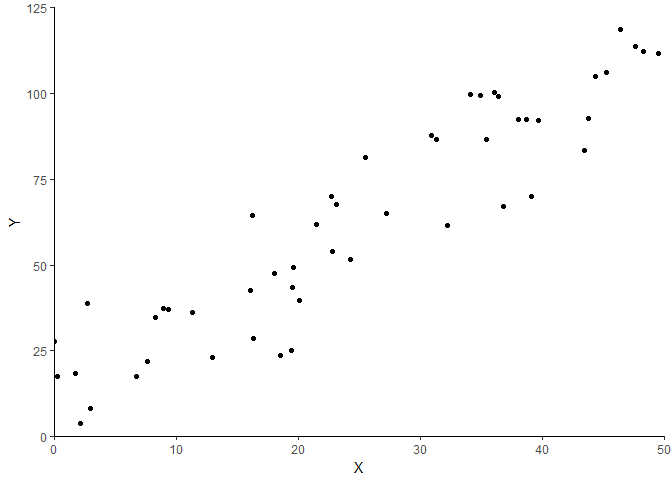
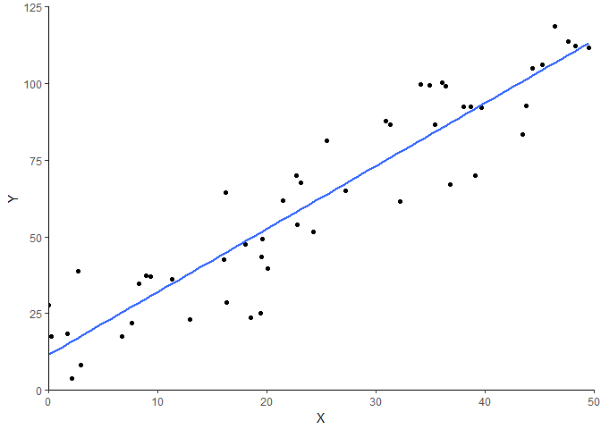
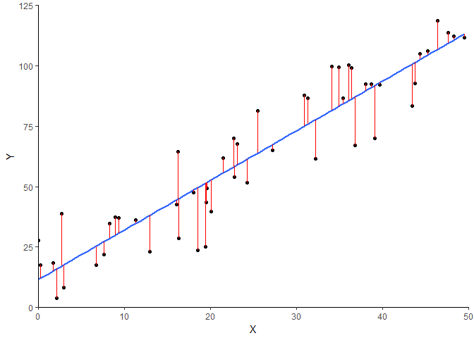

Basics of Linear Regression
================
Richard Blissett
2017-10-08

<base target="_top"/>

In this discussion, we will review the basics of ordinary least squares (OLS) regression through a guided review of a published research article using this method. This guide is not intended for those who are learning OLS for the first time - for that I recommend one of the following sources:

-   [Witte, R. S., Witte, J. S. (2015). *Statistics* (10th ed.). Hoboken, NJ: Wiley and Sons, Inc.](http://www.wiley.com/WileyCDA/WileyTitle/productCd-1118450531.html)
-   [Wooldridge, J. M. (2016). *Introductory Econometrics: A Modern Approach* (6th ed.). Mason, OH: South-Western.](http://www.cengage.com/c/introductory-econometrics-a-modern-approach-6e-wooldridge/9781305270107)

The Study
---------

This review will be drawing on an article by June Ahn, Austin Beck, John Rice, and Michelle Foster entitled [*Exploring Issues of Implementation, Equity, and Student Achievement With Educational Software in the DC Public Schools*](http://journals.sagepub.com/doi/abs/10.1177/2332858416667726). This research was published in *AERA Open* in late 2016. In this review, I neither seek to critique nor endorse the research of the authors, but rather to use this research as an example of OLS regression in action. For the sake of brevity, I will only be focusing on the first research question explored by the authors.

First, in order to discuss the use of OLS regression, it is important to understand the research questions that the authors investigated. In 2012, The District of Columbia Public School system began the implementation of a mathematics program called "First in Math" (FIM). According to the authors, this is a "web-based series of mathematics games where students practice mathematics computation skills such as addition, subtraction, multiplication, and division, as well as concepts such as fractions, decimals, and integers." Overall, the researchers (who were involved in a research-practice partnership) were interested in two aspects of the implementation of this program. Their research questions, quoted from the text, are below:

1.  "Were there differences in which students used FIM throughout the school year by indicators such as gender, race, prior achievement, and school environment?"
2.  "Was students' time spent in FIM correlated with improved performance in standardized math assessments?"

Again, this review will only focus on the first research question.

What Does OLS Do?
-----------------

Before we jump into the model from the authors, what is a regression model? As a reminder, the objective of ordinary least squares regression is to produce a model that minimizes the square of the residuals. What does this mean, in practice?

Consider the relationship between two correlated variables, x and y. If we were to graph the relationship between the two, it might look like this.

In the world of regression, we assume that there is some relationship between x and y and that we can model it using a line of some type. In this case, that would be a straight line. (This is not always the case, but here, it is.) Do you remember the equation for a line from algebra? Traditionally, the following equation is taught for a line.

*y* = *m**x* + *b*

The important pieces here are *m*, the slope of the line, and *b*, the y-intercept of the line. In the regression world, we are trying to find the equation of a line that will best fit our data. (We will get to what "best fit" means in a second.) See below for the same graph as above, but with the regression line on top of it.

This line, as per the discussion above, has a slope and a y-intercept. However as you can see, the data do not lie directly on top of the line. This means that if we are trying to use that line to predict the value of y from some value of x, we would most likely not be exactly right. As such, when we are describing the relationship between x and y in the regression world, we include an "error" term to capture this fact. In total, the notation for the relationship between x and y in the regression world is shown below.

*y* = *β*0 + *β*1*x* + *ε*

You will notice that this equation is basically just a modification of that line equation I wrote above, where *β*0 has been substituted for *b*, *β*1 has been substituted for *m*, and *ε* represents that error term I just mentioned.

Now, back to the earlier question: What do I mean when I say this is a "best fit?" After all, that line above could have a variety of slopes and y-intercepts. How does regression produce one singular line as we have above? The goal of this discussion is not to get into the deeper mathematics behind how it works, but I will try and give you an intuitive understanding. Remember that concept of "error" that I mentioned above? If you look at the graph, you could measure the amount of actual "error" (which, in our sample, we call residuals) there is for each data point by measuring the vertical distance between each dot and the regression line. See the red lines below.

The vertical lengths of those lines are formally called residuals. (There is a subtle distinction between errors and residuals in the regression world, but I think this conveys the general point.) Each data point has its own residual. To get the value of the residual, you would take the *x* value for a point, calculate using the equation the value of the line at that *x* value, and subtract it from the *y* value at that point. So, in other words, for all the residuals, we would first calculate the value of *y* on the line for each real *x* value in our data. We often denote this calculated *y* value as $\\hat{y}$, shown below.

$$\\hat{y} = \\beta\_0 + \\beta\_1 x$$

Second, we would subtract $\\hat{y}$ from *y* for each data point. In short, the goal of ordinary least squares is to estimate the equation of a line that will minimize the total of those distances. In more formal terms, OLS estimation finds a line that minimizes the (has the lowest) sum of the squared residuals. Thus, the term "ordinary least squares" regression.

The result of a regression estimation for the data above would be a value for *β*0 and a value for *β*1. The first is the predicted value of the outcome variable ($\\hat{y}$) when *x* is equal to 0, and the second is called the "regression coefficient," which represents the numerical relationship between *x* and *y*. We will get to interpreting that numerical relationship in real-world terms later.

Sound good? Okay, back to the study.

The Model
---------

As a reminder, for their first research question, the authors in this study were looking at the extent to which the usage of the FIM system varied according to a series of student and school characteristics. As in any study, it is important for us to define our terms.

**The sample.** First, who are the authors studying? As stated in the "Data Analysis" section of their paper, they limit their analysis to "all students in Grades 4-8 during the 2012-2013 school year." The data analysis, thus, is conducted at the student-level. (There were a couple of other data restrictions, but they are not overly important for the explanation here.)

**The dependent variable.** The FIM system logged the number of hours individual students spent on the system. The dependent variable (*y*) is the total number of hours that a student spent using the FIM system during the 2012-2013 school year.

**The independent variable.** As alluded to in the research question, the authors were interested in investigating several independent variables at once. They are listed below.

-   *Female*: whether a student was female
-   *English language learner status (ELL)*: whether a student was designated as an English language learner
-   *Special education status (SPED)*: whether a student was enrolled in a special education program
-   *Race*: the race of the student as identified in the data (Asian, American Indian, black, Hispanic, Multicultural, or Pacific Islander) with white students being the reference group (we will come back to this)
-   *Elementary school*: whether the student was in an elementary school (as opposed to a middle school - remember that the students are in grades 4-8 and as such, they are only in elementary and middle school)
-   *Student prior achievement*: the student's standardized test score from the previous school year, 2011-2012
-   *School prior achievement*: for each student, a weighted average of all of the achievement scores for the students in their school

As such, though they do not explicitly display the model they are testing, we can infer from their description that the model looks something like this.

$$
\\begin{aligned}
FIM = &\\beta\_0 + \\beta\_1(Prior Academic Achievement) + \\beta\_2(Female) + \\beta\_3(ELL) + \\\\
&\\beta\_4(SPED) + \\beta\_5(Asian) + \\beta\_6(American Indian) + \\\\
&\\beta\_7(Black) + \\beta\_8(Hispanic) + \\beta\_9(Multiracial) + \\\\
&\\beta\_{10}(Pacific Islander) + \\beta\_{11}(Elementary School) + \\\\
&\\beta\_{12}(School Prior Achievement) + \\varepsilon
\\end{aligned}
$$

Before going onto the results, there are probably some other things I should mention here.

**Multiple independent variables.** If you've kept the visual of that line graph above in your head, the introduction of more than one independent variable is probably going to be hard to visualize. How can we visualize this? The short answer is that we can't easily, because humans can't really visualize more than three dimensions. But the general concept is the same, even though we've now thrown out the ability to visualize a line. We are still trying to find an equation that will minimize the sum of the squared residuals, the difference between our real *y*'s and our estimated $\\hat{y}$'s. The only difference is that now, instead of just trying to find values for *β*0 and *β*1 that satisfy this criterion, we are looking for values of all of the *β*'s, 0 through 12. (By the way, this method, when it involves more than one independent variable, is called "multiple regression.")

But wait - if they wanted to test the relationship between all of these variables and FIM hours, why didn't they just do a series of t-tests and/or correlations? For that matter, why didn't they just run a series of regressions with only one variable on the right-hand-side of the equation at a time? Beyond all that I have stated thus far, and beyond the fact that such an analysis would invoke something that we call the "[multiple testing problem](https://en.wikipedia.org/wiki/Multiple_comparisons_problem)," this question gets to **the core reason why we like to do regression in the first place**. By including multiple variables, we are able to capture the relationship between two variables *independent of* other variables. Let us imagine that there was a strong relationship between prior test scores and FIM usage. Let us additionally imagine that there is a strong relationship between gender and FIM usage. Were we to find a statistically significant relationship between gender and FIM usage using a t-test or a simple bivariate regression, we might be concerned that the relationship we found exists because both gender and FIM usage are associated with prior test scores. However, by including prior test scores, we are able to "partial out" the association with gender. In other words, whatever we find for the association with gender cannot be attributed to differences in test scores across gender because that relationship is instead now captured by the coefficient on test scores. (The reasons for controlling for variables in multiple regression are a bit more complicated than this, but this is the basic intuition.) In summary, we use multiple regression because it allows us to look at the partial associations of variables with the outcome variable independent of the associations with other variables included in the model.

**Standardized test score.** This isn't strictly a regression concept, but it's still important to have a reminder. "Standardization," in statistics, is the process of turning some raw measure into a "z score." What is a z score? Formally, a z score is calculated as follows.

$$z = \\frac{x-\\overline{x}}{s\_x}$$

In other words, you take each value in a set of data, subtract the mean of the set of data, and divide by the standard deviation for that set of data. For our purposes, what this calculation importantly does is change the units of that variable to be in standard deviation units. Why would we do this? Well, consider standardized tests in education (a highly relevant example). Let's say I told you that on some standardized test, a student got a score 10 points below average. Is that a big deal? Should we be concerned? Well, it depends on how spread out the data is. If it's pretty normal for people to vary from the mean by an amount of 10 points or more, then we wouldn't be as concerned. On the other hand, if varying by 10 points from the mean is not expected, we would be concerned. By changing that "10" into standard deviation units, we can get a more intuitive sense of whether it is a big deal. We won't get into detail here about how big is too big for a z score because that falls into a different realm of discussion (significance and hypothesis testing), but know that this is the point of standardization.

**Categorical variables.** But wait, how do we visualize that line from before in the case when a variable isn't numeric, like gender? (Once we get beyond modeling two numeric variables, I would try and stop being so tied to the line visual. It just makes the general point.) The point still works the same. We usually include categorical data in our analyses as "dummy" or "binary" indicators, or variables that take on the values 0 and 1. So in the case of gender, while I don't have the authors' data, I can probably safely assume that in their data, they have a column for each student with 0's and 1's, where a value of 1 indicates that the student in female and a value of 0 means that the student is male.

Why, in the equation above, do we have an indicator for "female" and not for "male?" In the same vein, why don't we have an indicator for "white," but we have indicators for all of the other racial groups? It's a mathematical issue. Basically, you cannot include two variables in a regression model that perfectly predict each other (also called "perfect collinearity"). In their data, it is likely that case that all students are either male or female. Thus, if we know whether a student is female, we also automatically know if they are male because the options are mutually exclusive. (Of course, we could problematize this fact in data analysis, but that is beyond the scope of this discussion.) Thus, we pick one, and we leave the other out of the equation because then the coefficient *β*2, in this case, can represent the association of being female *in contrast to being male*.

What about when there are multiple categories, like race? The same logic applies: In the data, the racial categories are mutually exclusive (again, subject to problematization). Thus, if we know a student is Asian, we know they are not white. If we know a student is not Asian, American Indian, Black, Hispanic, Multiracial, or Pacific Islander, then we know they are white. You have to leave one category out to serve as a reference group as before. Therefore, the interpretations of the association of being black (*β*7), for example, is *in contrast to being white*.

The Results
-----------

For your viewing convenience, the main results table from the authors' investigation of their first research question is reproduced below.

Let's have fun, shall we? I am going to step through this piece by piece to make sure we understand how to interpret every piece of this table.

First, let's understand the layout. This is one common way of displaying regression results. The "B" at the top of the second column indicates that the values in that column are the *β* values - the regression coefficients - for our regression equation. The "SE" stands for "standard error," so these are the standard errors for the associated regression coefficients. Finally, the "p" column has p-values for the associated regression coefficients. I will address each of these in turn.

**Regression coefficients.** As mentioned, these values represent the numerical relationship between each independent variable and the outcome, which is in this case hours spent with the FIM system. But what do they mean for us in real life? After all, we can't just tell someone that the relationship between gender and FIM hours is -0.662 and hope they know what we mean in abstract. The classic, general way to interpret an ordinary least squares coefficient is that the number represents *the expected unit change in the outcome variable for a one unit change in the independent variable, if all other independent variables are held constant*. (The "all else held constant" part is often not explicitly stated when people discuss regression results, as it is implied by the use of regression in the first place.)

Let's take a look at the categorical variables first. On "Female," we see that we have a *β*2 value of -0.662. Knowing that the variable "Female" is likely coded 0 for male and 1 for female, this means that a switch from a value of 0 to a value of 1 is associated with a 0.662 decrease in hours spent on FIM. Taking this a step further into "real-world" language, we would say that compared to males, females spent 0.662 fewer hours with FIM. Indeed, this is the interpretation provided by the authors: "It appears that female students spent less time in FIM than their male peers (about 40 min less over the year)." A similar interpretation is made for Asian students, where being Asian has a regression coefficient of 3.79. This means that Asian students, controlling for other characteristics in the model, spent 3.79 more hours with the FIM system. The authors confirm this conclusion: "Asian and Black students spent &gt;3 more hr in FIM over the course of the year."

Now, let's look at a continuous variable: prior academic achievement. Using the guide I presented above and simply substituting words, 1.626 is *the expected hours change in FIM usage for a one standard deviation change in prior academic achievement, if all other independent variables are held constant*. Again, making this more interpretable, we might say that according to our model, an increase in prior academic achievement by one standard deviation is associated with a 1.626 hour increase in FIM usage. This interpretation is indeed what the authors report: "Our results suggest that a student who scored 1 SD higher in the prior year's DC-CAS exam spent 1.6 more hr using FIM."

**Standard errors.** This review does not cover the depths of significance testing, but it is important to note what the standard errors are here for. In brief, they give us a sense of the extent to which the value we got for the regression coefficient could have varied in other samples. While we often do not interpret the standard error directly, it provides us very important information for determining if the regression coefficient we found is statistically significant. Typically, regression coefficients are tested using a t-test, where the t-statistic is calculated as follows.

$$t = \\frac{\\beta}{SE}$$

As is always the case in significance testing, we then compare the value of the t statistic to what we know about the t distribution to determine the probability of obtaining a t-statistic at least that far from 0 by chance alone. (Which I talk about next.)

How standard errors are reported in regression tables depends on the publication. Sometimes, rather than being listed next to the coefficients as they are here, they are listed in parentheses below the coefficients. In some papers, the standard errors are not reported at all and instead are replaced with the t-statistics.

**P-values.** It is often not the case that p-values are reported, but here, they are, so let's talk about them. These p-values are the probabilities I just mentioned above. A p-value of 0.3, for example, means that there is a 30% chance of obtaining a regression coefficent that far from 0 by chance alone. In social science, we often consider 0.10 or 0.05 as thresholds for us to be able to claim that the coefficient is statistically significant.

Take, for example, the coefficient on being American Indian. Without inspecting the p-value and/or standard error, we might erroneously conclude that being American Indian (as opposed to white) is associated with a 1.23 increase in hours spent with FIM. However, upon inspection of the p-value, we find that this is not a statistically significant relationship, and thus we cannot be reasonably sure that this association did not appear by chance alone.

*Important*: The interpretation of statistical significance should, ideally, involve slightly more nuance than is presented here in light of things like sample sizes, expected effect sizes, etc., but that discussion is beyond the scope of this review. For more information on this nuance, see the [American Statistical Society's official statement on p-values](http://amstat.tandfonline.com/doi/full/10.1080/00031305.2016.1154108).

Often, papers will omit the p-values and instead just indicate different levels of statistical significance on regression coefficients by adding asterisks or some other superscripted notation. The explanation of notation is typically (should be) in the table notes.

**R****2** **value.** Remember this? If not, here's a reminder: The *R*2 value is one of a set of calculations in the statistical world known as "goodness-of-fit" measures. Overall, the *R*2 is a measure of the extent to which your model *as a whole* is explaining the variation in your outcome variable. The interpretation of the *R*2 is often done in percentages. In this case, an *R*2 of 0.074 means that 7.4% of the variation of FIM hours across individuals can be explained by the combination of the variables included in the model (e.g., gender, prior academic achievement).

What is a good *R*2 value? In my experience, the answer to this question depends on the goals of the research as well as the expectations of the field. In the social sciences, where we often are trying to predict human behavior, lower *R*2 values are fairly normal. However, at the same time, higher *R*2 values are expected from people who are asking research questions or making conclusions that imply that they are trying to accurately predict the outcome variable. In particular, keep in mind this piece of advice from [Robert Nau](http://www.fuqua.duke.edu/faculty_research/faculty_directory/nau/) at Duke University: "**R-squared is not the bottom line.** You don't get paid in proportion to R-squared. The real bottom line in your analysis is measured by consequences of decisions that you and others will make on the basis of it. In general, the important criteria for a good regression model are (a) to make the smallest possible errors, in practical terms, when predicting what will happen in the future, and (b) to derive useful inferences from the structure of the model and the estimated values of its parameters."

Closing Thoughts
----------------

In the conclusions, the authors state: "Students of color show more time spent with FIM, and it appears that schools that serve lower-achieving students are providing students more access to the program (e.g., students in lower-achieving school environments are spending more time in FIM)." In addition, they continue: "However, our analyses also suggest areas that require further inquiry for DCPS. For example, female students are spending less time in FIM, and students who are already higher achieving spend substantially more time in the program. These patterns compel further questions about those students who are not using FIM."

The goal of this review is that you are able to read the above conclusions and understand, at a relatively sophisticated level, from where the authors draw these conclusions. I hope this overview was useful. Please let me know if you have any suggestions for additions.
